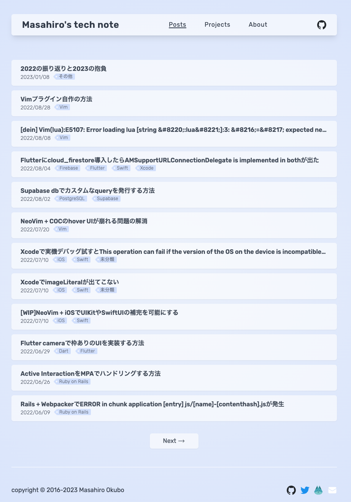

# Jamstack blog site with Next.js and WordPress
Demo site: [https://masahiro.me/](https://masahiro.me/)


### Step 1. Prepare your WordPress site

First, you need a WordPress site. There are many solutions for WordPress hosting, such as [WP Engine](https://wpengine.com/) and [WordPress.com](https://wordpress.com/).

Once the site is ready, you'll need to install the [WPGraphQL](https://www.wpgraphql.com/) plugin. It will add GraphQL API to your WordPress site, which we'll use to query the posts. Follow these steps to install it:

- Download the [WPGraphQL repo](https://github.com/wp-graphql/wp-graphql) as a ZIP archive.
- Inside your WordPress admin, go to **Plugins** and then click **Add New**.


- Click the **Upload Plugin** button at the top of the page and upload the WPGraphQL plugin.


- Once the plugin has been added, activate it from either the **Activate Plugin** button displayed after uploading or from the **Plugins** page.


#### GraphiQL

The [WPGraphQL](https://www.wpgraphql.com/) plugin also gives you access to a GraphQL IDE directly from your WordPress Admin, allowing you to inspect and play around with the GraphQL API.


### Step 2. Set up environment variables
Copy the `.env.local.example` file in this directory to `.env.local` (which will be ignored by Git):

```bash
cp .env.local.example .env.local
```

Then open `.env.local` and set `WORDPRESS_API_URL` to be the URL to your GraphQL endpoint in WordPress. For example: `https://myapp.wpengine.com/graphql`.

Your `.env.local` file should look like this:

### Step 3. Set up navbar
**Set navbar contents**
- url -> wordpress single page slug
- title -> display name
```typescript
// lib/constants.ts
export const PAGES = [
  { url: 'about', title: 'プロフィール' },
  { url: 'mvp-programing-document', title: 'MVP教室' },
  { url: 'contact', title: 'Contact' }
];
```

## How to run
```bash
yarn install
yarn dev
```

## Lint
```
yarn run lint:fix
```

## Deploy your own
Once you have access to [the environment variables you'll need](#step-3-set-up-environment-variables), deploy the example using [Vercel](https://vercel.com?utm_source=github&utm_medium=readme&utm_campaign=next-example):

[](https://vercel.com/new/git/external?repository-url=https://github.com/masahiro04/nextjs_wordpress&env=WORDPRESS_API_URL&envDescription=Required%20to%20connect%20the%20app%20with%20WordPress&envLink=https://vercel.link/cms-wordpress-env)

